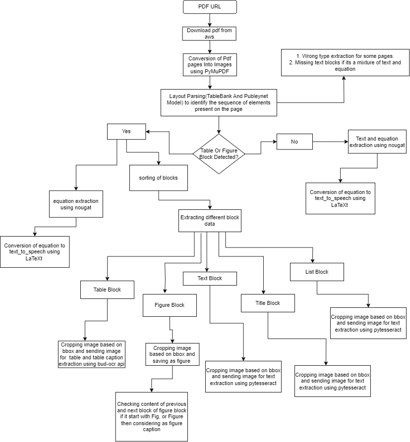

# PDF-Data-Extraction-Pipeline

**Project Summary:** This project utilizes a combination of various python models and libraries, including Layout Parser, Detectron2, LatexOcr, Bud-OCR,PyMuPDF, pdf2img, pytessaract and more, to extract figures, figure captions, tables, table captions, equations, and text from pdf documents.

## Code flow for pdf data extraction


### System Requirements
**Linux OR Mac and**
**Python: > 3.8**

### Quick Start
**Step 1.**
Create the virtual environment: Use the python3 -m venv command to create a virtual environment. Replace your_env_name with the name you want to give to your virtual environment:
```bash
python3 -m venv your_env_name
```

**Step 2.**
Activate the virtual environment: You need to activate the virtual environment to start using it. Use the following command:

```bash
source your_env_name/bin/activate`
```

**Step 3.**
Clone pdf_extraction_pipeline repo

```bash
git clone https://github.com/BudEcosystem/pdf_extraction_pipeline.git
```

**Step 5.**
Installation, run requirements.txt file to install required packages

``` bash
pip install -r .\pdf_extraction_pipeline\requirements.txt
```

**Step 6.**
Create .env file inside pdf_extraction_pipeline folder and copy the key content of example.eve to .env file
open .env and modify the environment variables 

**Step 7**
Run process_pdf.py file to expract pdf data and Run process_epub.py file to extract epub data and to run pdf extraction using rabbitmq please read instructions given in Readme file inside pdf_pipeline folder

```bash 
python pdf_extraction_pipeline/process_pdf.py
```
```bash 
python pdf_extraction_pipeline/process_epub.py
```


**Note** 
if you are getting any installation error, then manually install packages and models one by one,

## Installation of various models used

**Installation of Layout Parser and Detectron2**
To detect the layout of a document image (https://layout-parser.readthedocs.io/en/latest/notes/installation.html)

```bash
pip install layoutparser	
```

```bash
pip install "layoutparser[effdet]"		
```

```bash
pip install layoutparser torchvision && pip install "git+https://github.com/facebookresearch/detectron2.git@v0.5#egg=detectron2"		
```

```bash
pip install "layoutparser[paddledetection]"		
```

```bash
pip install "layoutparser[ocr]"		
```

```bash
pip install layoutparser torchvision && pip install "detectron2@git+https://github.com/facebookresearch/detectron2.git@v0.5#egg=detectron2"

```
```bash
pip install "layoutparser[ocr]"	
```

**Nougat Installation**
To extract equation's latex code (https://github.com/facebookresearch/nougat)

```bash
pip install nougat-ocr
```

**LatexOcr**
To extract latex code from image containg equation (https://github.com/lukas-blecher/LaTeX-OCR)

```bash
pip install "pix2tex[gui]"
```

**Installation of various python packages**
install required package by using following command

```bash
pip install package_name
```
